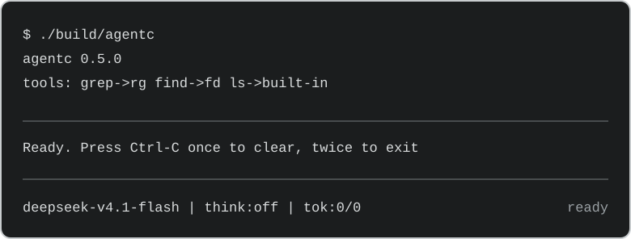

# agentc

A minimal, extensible coding agent in **freestanding C23** — zero libc, static
binaries, direct platform networking, vendored mbedTLS, and a versioned C ABI for
C and Rust extensions.

The bar we aim for is [pi](https://github.com/earendil-works/pi) — a minimal coding
agent — for its extensibility and UX, in one static binary that starts in under
1 ms and idles at about 0.7 MB of RSS on startup, inside the 12 MB session
budget. The release binary is about 760 KiB stripped (~916 KiB unstripped);
`make bench` reports startup time, idle RSS and binary size on your machine.

## Quick start

```sh
# Linux / macOS
curl -fsSL https://raw.githubusercontent.com/abird-ai/agentc/master/install.sh | sh

# Windows (PowerShell)
irm https://raw.githubusercontent.com/abird-ai/agentc/master/install.ps1 | iex

agentc setup                  # pick a provider, store credentials, pick a model
agentc "summarise this repository"
```



The installer downloads the release archive for your platform, verifies its
SHA-256, and installs `agentc` to `~/.local/bin` (`AGENTC_INSTALL_DIR` overrides
the directory, `AGENTC_VERSION=0.5.0` pins a release). Prefer to build from
source? See [Build and test](#build-and-test).

## Build and test

```sh
make                      # -> build/agentc   (native: Linux x86-64, macOS)
make check                # offline golden suite + extension pipeline
make ext-pipeline         # C + Rust extension harness -> build/ext_harness
make release-exts         # release binary with extensions/manifest.json linked
./tests/e2e.sh            # mock provider: tool round-trip, --continue, pty TUI
./tests/net.sh            # live loopback HTTP/SSE/TLS
./tests/mcp.sh            # MCP stdio against a python mock
./tests/ext.sh            # C and Rust extension examples
make bench                # startup, RSS, binary size
make install PREFIX=~/.local   # -> $(PREFIX)/bin/agentc
make dist                 # release tarball + SHA256 -> dist/

make windows              # cross build -> build/agentc.exe (LLVM on PATH)
make wine-check           # run the Windows golden suite under Wine (Linux)
make release CC="clang --target=aarch64-unknown-linux-gnu" ARCH_FLAGS=-fno-pic \
     REL_OBJDIR=build/obj/aarch64/release OUT=build/agentc-aarch64
nix build .#release-all   # every target at once (see below)
nix build                 # or nix develop (flake.nix)
```

Releases are built by Nix on one Linux runner, which cross-compiles every
target and attaches the archives to the tag:

```sh
nix build .#release-all
ls result-release/bin/
# agentc-linux-x86_64  agentc-linux-aarch64  agentc-linux-riscv64
# agentc-windows-x86_64  agentc-macos-arm64  agentc-macos-x86_64
# agentc-macos-universal
```

The Linux builds are freestanding on three architectures (x86-64, aarch64,
riscv64) and the Windows build links no CRT/SDK (import libraries are generated
from `src/win/*.def`). The macOS slices carry the Apple SDK (fetched by Nix) and
link libSystem through LLVM's Mach-O linker; `llvm-lipo` merges them into a
universal binary.

## Platform support: what is tested, and where help is wanted

| target | builds | test suite | tested by hand |
|---|---|---|---|
| Linux x86-64 | yes | golden, e2e, live net/TLS, MCP, extensions | yes |
| Linux aarch64 | yes | golden suite under `qemu-user` | yes |
| Linux riscv64 | yes | golden suite under `qemu-user` | yes |
| macOS arm64 | yes | golden suite, natively on a Mac runner (CI) | no |
| macOS x86-64 | yes | same, through the native Mac runner | no |
| Windows x86-64 | yes | golden suite under Wine (CI: real `cmd.exe`, `pwsh` missing-shell error) | no |
| Windows arm64 | yes (PE header checked) | golden suite under native Wine on an ARM64 runner (CI, non-gating) | no |

*Tested by hand* means a person has run that binary for a real session on that
platform, which is not the same as a suite passing in CI. Linux is exercised end
to end, including the cross-built binaries under qemu. Windows x86-64 now runs
the full golden suite under Wine in CI (`make wine-check`, `tests/wine.sh`);
that exercises the Win32 syscall surface, the CRT-free startup, file, console
and socket paths, the `WSAPoll` translation, and real `cmd.exe` execution
(output capture, redirection, exit codes, cancellation, background drain and
truncation). Wine ships no PowerShell 7, so the suite asserts the clear
missing-shell error for `pwsh` there instead of pretending a shell ran. On a
real Windows host the bash tool also runs PowerShell; the `shell` config key
selects it — `auto` (default: `cmd.exe`, always present), `cmd`,
`powershell` (PowerShell 7 if installed, otherwise built-in 5.1), or `pwsh`
(PowerShell 7 only); `AGENTC_SHELL` overrides the file, and a missing requested
shell is a clear error, never a silent fallback. Wine is its own Win32
reimplementation, not Windows, so SChannel/TLS against a real provider, real
console behaviour, real PowerShell 5.1/`pwsh` execution and Windows ARM64 (Wine
does not emulate a CPU) remain untested. The macOS and Windows ports compile,
link and produce valid Mach-O/PE images, but nobody has driven those builds by
hand yet: treat a real Windows kernel and console, TLS against a real provider
and the macOS TUI as unverified. The CI jobs also build and load a real
extension library (`make ext-dylib`/`win-ext-dylib`, `tests/dyn.sh`, `make
dyn-check`), so dynamic extension loading on macOS/Windows is CI-gated rather
than hand-tested.

If you use macOS or Windows, testing is genuinely useful:

- run one real session with a provider (`agentc setup`, then a prompt that calls
  a tool) and report what broke in an issue, with the binary you downloaded and
  your OS version;
- the TUI is where platform differences bite first (resize, unicode width,
  Ctrl-C, paste, the inline bottom region or `--tui-mode fullscreen`);
- on Windows, the shell tool now runs (`cmd.exe` by default; the `shell` config
  key also selects `powershell`/`pwsh`, and `AGENTC_SHELL` overrides it) — a
  real session with `agentc --version`, `--list-models` and a prompt that calls a
  tool is the most useful report, especially from a machine that only has
  Windows PowerShell 5.1; `make win-tests` followed by
  `pwsh tests/run-built.ps1` runs the golden suite once per shell if you have
  LLVM and make installed;
- on macOS, `make` and `make check` are enough; please also mention whether you
  are on Apple silicon or Intel, since the two slices are built separately.

Fixes for anything found are welcome as pull requests — the platform layer is
small and self-contained (`src/plat/<os>`, `src/net/<os>`), and those directories
are the only place a port needs to touch.

Toolchain: `clang -std=c23 -ffreestanding -nostdlib -static` (no libc, own
allocator, own `_start`), GNU make, optional python3 for the extension registry.
The freestanding targets build with `-nostdinc` plus `third_party/freestanding/`,
so a host libc header cannot leak in through a vendored library.
macOS arm64/x86-64, Windows x86-64 and the three Linux architectures build from
the same tree.

## Providers, models and first-run setup

```sh
agentc setup [--offline]                 # pick a provider, store credentials, pick a model
agentc --list-models [filter]             # every known model (catalog + discovered)
agentc --refresh-models                   # ignore the 24 h discovery cache
agentc --provider ollama --model llama3.2 # local Ollama through its OpenAI endpoint
agentc --provider xai --model grok-4 --api-key $XAI_API_KEY
```

Out of the box: `anthropic`, `openai`, `google` (native Gemini API),
`ollama` (local, no key needed), `ollama-cloud`, and the OpenAI-compatible
presets `openrouter`, `xai`, `deepseek`, `groq`, `mistral`, `together`, `gemini`
— all one adapter except the native ones, different base URL.
Extensions can contribute providers and models too: a linked extension registers
its own wire dialect (request builder + SSE mapping) and static model metadata
through `add_provider`, while the core keeps transport, retries, credentials and
header sanitization (`extensions/fake_provider/` is the reference).

MCP is more than tools: when a server advertises `prompts` or `resources`, its
prompts appear as `/mcp__<server>__<prompt>` commands (a bounded synchronous
`prompts/get`) and its resources are exposed through three generic read-only
tools — `mcp_list_resources`, `mcp_list_resource_templates`, `mcp_read_resource`
(text contents only; `blob` entries are rejected). A linked extension can add
skill, prompt and theme roots through `resources_discover` (absolute paths under
the config home or a trusted project cwd; consumed once at startup), so prompts
and named themes ship with the extension without an ABI change. Limits: 64 file
templates/themes per scan, 512 prompt registrations, MCP prompts 128/server and
512 total, MCP resources 256/server and 1024 total, MCP prompt text 64 KiB and
resource text 256 KiB (over the cap the call fails rather than truncating). A
failed MCP server is retried behind a capped exponential backoff (set
`AGENTC_MCP_RETRY_MS=0` to disable), its `connecting`/`ready`/`failed` status is
published through `mcp_servers_change`, and an idle stdio server's `list_changed`
notification is picked up on the next pump without a request.

- **Model discovery:** models come from the built-in catalog plus
  `GET /models` on the configured endpoint (Ollama's `/api/tags` first, so family
  and size show up in the picker). Results are cached per provider in
  `~/.config/agentc/models-cache.jsonc` for 24 h and refreshed in the background of
  `--refresh-models`; `--offline` disables network probes and cache misses are
  never fatal.
- **First run:** a bare `agentc` on a tty with no credential, no setup file and no
  flags offers a short menu (local Ollama is probed for you). Choices are written
  to `~/.config/agentc/setup.jsonc` and `~/.config/agentc/auth.jsonc` (0600, merged so
  existing keys and OAuth logins survive).
- **Precedence:** flags › `config.jsonc` › `setup.jsonc`; credentials come from
  `--api-key`, then OAuth, then provider env vars (`OLLAMA_API_KEY`,
  `OPENROUTER_API_KEY`, …), then `auth.jsonc`.

Interactive commands: `/model [id]` reports or switches the model, `/help`,
`/theme [dark|light|<name>]` (named themes come from `themes/<name>.jsonc`),
`/skill:<name>` submits a skill body, any registered prompt template
(including MCP `mcp__<server>__<prompt>` commands) runs as `/name`, `/clear`,
`/new`, `/quit`. The default UI is the inline
mode: the app owns a fixed region at the bottom of the terminal and keeps
finished transcript blocks in the terminal's own scrollback, so shell history
above the region survives. `--tui-mode scrollback` is the append-only renderer
(no owned region) and `--tui-mode fullscreen` gives the alternate-screen
viewport; `--tui-mode auto` and the `tui_mode` config key resolve to inline.

## Decisions

- **Language:** freestanding C23; no assembly, no runtime.
- **TLS:** vendored freestanding mbedTLS 3.6.2 on Linux; the OS stacks elsewhere
  (SecureTransport on macOS, SChannel on Windows). The TLS path never `dlopen`s.
- **Ollama:** used through its OpenAI-compatible `/v1` endpoint — one wire path for
  every OpenAI-style provider, no second SSE mapper.
- **Formats:** JSONC config/auth/themes, serde-default JSONL sessions; no
  cross-agent file-format compatibility.
- **Auth:** OAuth subscription logins (Claude Pro/Max, ChatGPT) ship in the
  initial release.
- **Extensibility:** MCP first, then a versioned C ABI (`include/agentc_ext.h`)
  whose tools may be synchronous or asynchronous. Extensions are linked into the
  binary, or on macOS/Windows loaded at runtime from `<config home>/extensions/`
  (the Linux freestanding build is static-only).
- **Parallel tool execution** on by default; **MIT** licensed.

## Related

- [pi](https://github.com/earendil-works/pi) — a minimal, extensible coding agent;
  the design inspiration for the UX, extension model and tool set here.
- [Model Context Protocol](https://modelcontextprotocol.io) — the standard `agentc`
  speaks to expose MCP tools, prompts and resources.
- [Mbed TLS](https://github.com/Mbed-TLS/mbedtls) — the vendored TLS backend on
  Linux.
- [curl CA extract](https://curl.se/ca/cacert.pem) — the Mozilla CA bundle used as
  trust anchors, replaced by a system bundle when one is present.
- Provider APIs: [OpenAI](https://platform.openai.com),
  [Anthropic](https://www.anthropic.com), [Google Gemini](https://ai.google.dev),
  [Ollama](https://ollama.com), and the OpenAI-compatible hosts
  [OpenRouter](https://openrouter.ai), [xAI](https://x.ai),
  [DeepSeek](https://www.deepseek.com), [Groq](https://groq.com),
  [Mistral](https://mistral.ai) and [Together](https://www.together.ai).
- Built with [clang/LLVM](https://llvm.org), [Nix](https://nixos.org),
  [Rust/cargo](https://www.rust-lang.org) and GNU make.

## Inspiration and thanks

`agentc` is built with heavy inspiration from
[pi](https://github.com/earendil-works/pi) by Mario Zechner — a minimal,
extensible coding agent whose UX, extension model, tool set and durable/MCP
concepts shaped this design. pi is MIT licensed; no pi code or text is copied
here, but its ideas are a foundation we build upon and are grateful for.

The architecture and design record live in [.agents/](.agents/) —
[design/](.agents/design/) for the module contracts and the forward-looking
plans in [plans/](.agents/plans/). They are agent-facing and are not part of the
release artifacts.
